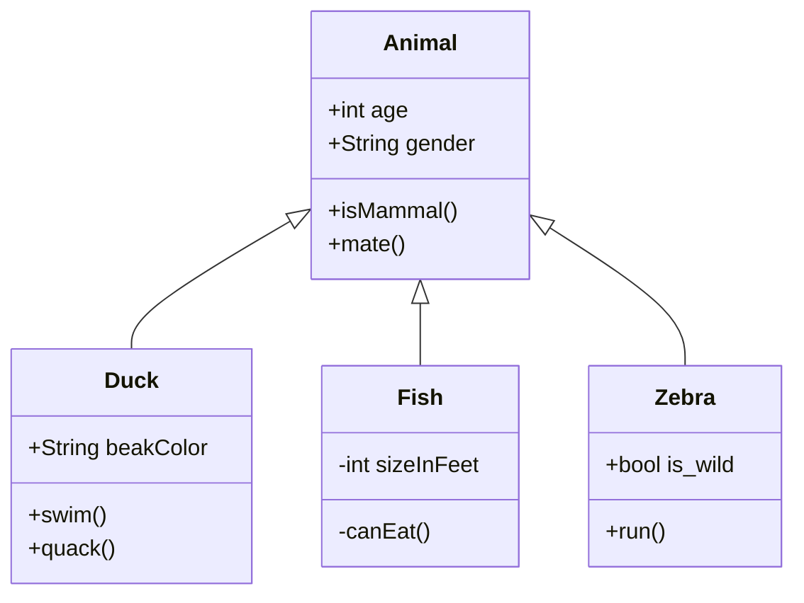

# ts-axios
Get info from url with Axios

```console
npm install --save-dev ts-node typescript
npm install axios
```

## Start application
```console
npm run start
```

## Expected Result
```console
ID: 1
TITLE: delectus aut autem
COMPLETED: false
```

##This is a test

